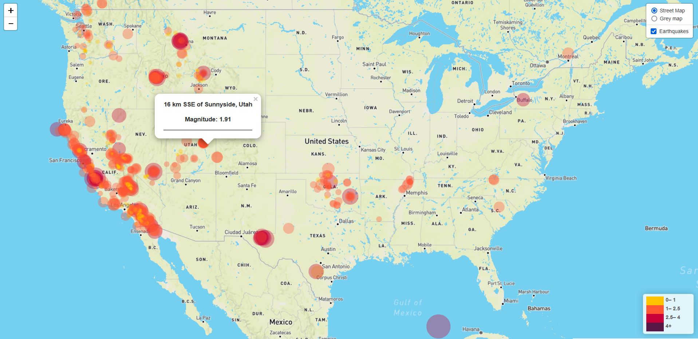

# Leaflet-challenge/ Level 1

In the basic visualisation I have created a map that plots all the earthquakes within the last seven days (from the time of downloading the file) based on their longitude and latitude.

I have included popups that contain information on the location and magnitude of the earthquake as well as a legend describing the colors vs magnitude. 

